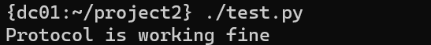

# CS6378 Advanced OS
Contains the project2 assignments for the advanced os class.

| Student Name |   NetID   |
| :----------: | :-------: |
| Kushan Singh | kxs200085 |
| Akshay Jain  | axj190052 |

# Aim 
The objective of the project is to check the performance of Lamport’s mutual exclusion protocol with respect to Response Time and System Throughput.

# Implementation 
The project is implemented in C++ using TCP Sockets. The application module interacts with the service module only through csEnter() and csLeave() function calls.

# Steps to compile

1. Make all shell scripts executable.
    ```bash
    $ chmod +x *.sh
    ```
2. Copy `project2` from your local system to the home directory on the `dcXX.utdallas.edu` nodes.
    ```bash
    $ ./copy_to.sh
    ```
3. Log into any one node on `dcXX.utdallas.edu` and compile the program.
    ```bash
    $ ssh -l <netid>@dcXX.utdallas.edu
    {dxXX:~} cd project1/ && make node
    ```
4. Launch the program from your local system.
    ```bash
    $ ./launcher.sh
    ```
5. Clean up the processes with the cleanup script. 
    ```bash
    $ ./cleanup.sh
    ```

6. Run the testing script.
    ```python
    $ chmod +x test.py
    $ ./test.py
    ```

7. The performance metrics were calculated using the following script.
    ```python
    $ chmod +x get_performance_metrics.py
    $ ./get_performance_metrics.py <num_nodes>
    ```

# Testing 
The mechanism that was used to test the correctness of the protocols was using a central shared file where each process logs when they enter and exit a critical section in the following format: `Timestamp,NodeId,Start/End`. This way no two enters or no two exits should be adjacent.

## Sample Output Log


## Sample Output No Error


## Sample Output Error


# Observations
For all observations, we considered the `number of nodes to be 8` where each node generates `1000 Critical Section Requests`.
We plot 4 graphs:
- [Mean Response Time Vs Inter Request Delay](#mean-response-time-vs-inter-request-delay)
- [Mean System Throughput Vs Inter Request Delay](#mean-system-throughput-vs-inter-request-delay)
- [Mean Response Time Vs Mean Critical Section Execution Time](#mean-response-time-vs-mean-critical-section-execution-time)
- [Mean System Throughput Vs Critical Section Execution Time](#mean-system-throughput-vs-mean-critical-section-execution-time)

While plotting graphs for `Mean Response Time/ Mean System Throughput Vs Inter Request Delay`, the value of `Inter Request Delay` were `{0,2,4,6,8,10} ms` and `Critical Section Execution time` was `5 ms`.

While plotting graphs for `Mean Response Time/ Mean System Throughput Vs Mean Critical Section Execution Time`, the values of `Critical Section Execution` were `{0,2,4,6,8,10} ms` and `Inter Request Delay` was `5 ms`.

For each value of `Inter Request Delay/ Critical Section Execution` multiple iterations were performed and the mean value was taken to plot the final graph.

# Mean Response Time Vs Inter Request Delay


# Mean System Throughput Vs Inter Request Delay


# Mean Response Time Vs Mean Critical Section Execution Time


# Mean System Throughput Vs Mean Critical Section Execution Time


# Conclusion
- The `Response Time` increased as the value of `Critical Section Execution Time` increased. Thus they are directly proportional to each other.
- The `System Throughput` decreased as the value of `Critical Section Execution Time` increased. Thus they are inversely proportional to each other.
- A more detailed report can be found in `AOS_Project_2.pdf`.
